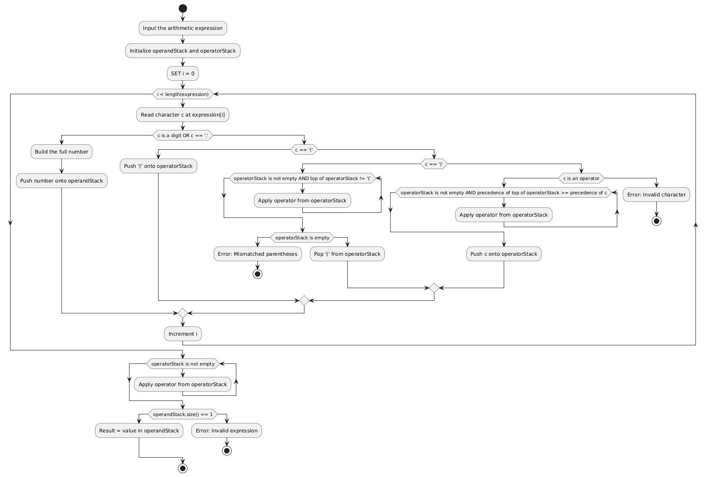

# ExpressionEvaluator Pseudocode

---

## 1. Operator Precedence

```pseudo
operatorPrecedence = {
    '+' -> 1,
    '-' -> 1,
    '*' -> 2,
    '/' -> 2,
    '^' -> 3
}
```


- + and - have the lowest precedence (1).
- * and / have medium precedence (2).
- ^ (exponent) has the highest precedence (3).

## 2 Main Evaluation Function

```pseudo
FUNCTION evaluate(expression):
    CREATE empty STACK operandStack
    CREATE empty STACK operatorStack
    SET i = 0

    WHILE i < length(expression):
        SET c = character at expression[i]

        IF c is a digit OR c == '.':
            CREATE string num = ""
            WHILE i < length(expression) AND (expression[i] is digit OR '.'):
                APPEND expression[i] to num
                i = i + 1
            CONVERT num to double => value
            PUSH value onto operandStack
            CONTINUE  // skip i++ since we've already moved 'i' inside the loop

        ELSE IF c == '(':
            PUSH c onto operatorStack

        ELSE IF c == ')':
            WHILE operatorStack not empty AND top(operatorStack) != '(':
                CALL applyOperation(operandStack, POP from operatorStack)
            IF operatorStack is empty OR POP from operatorStack != '(':
                THROW error "Mismatched parentheses"

        ELSE IF c in operatorPrecedence:
            WHILE operatorStack not empty AND
                  operatorPrecedence[top(operatorStack)] >= operatorPrecedence[c]:
                CALL applyOperation(operandStack, POP from operatorStack)
            PUSH c onto operatorStack

        ELSE:
            THROW error "Invalid character in expression: " + c

        i = i + 1

    // Apply remaining operators
    WHILE operatorStack not empty:
        CALL applyOperation(operandStack, POP from operatorStack)

    IF operandStack.size() != 1:
        THROW error "Invalid expression format"

    RETURN POP from operandStack
```

1. **Initialize Stacks**  
   One for numbers (`operandStack`) and one for operators (`operatorStack`).

2. **Parsing Loop**  
   Go through each character in the `expression`.

3. **Number Detection**  
   If the character is numeric or a decimal point, build a complete number and push it onto `operandStack`.

4. **Parentheses Handling**  
   -- If `(`, push onto `operatorStack`.  
   -- If `)`, pop operators until a matching `(` is found.

5. **Operator Handling**  
   Compare precedence with the top of `operatorStack`, applying any operators with equal or higher precedence before pushing the current one.

6. **Apply Remaining Operators**  
   Once all characters are processed, apply any remaining operators in `operatorStack`.

7. **Result**  
   The final value is the single item left on `operandStack`.


## 3 Helper Function: applyOperation

```pseudo
FUNCTION applyOperation(operandStack, operator):
    IF operandStack.size() < 2:
        THROW error "Invalid expression"

    SET b = POP from operandStack
    SET a = POP from operandStack

    SWITCH (operator):
        CASE '+':
            PUSH (a + b) onto operandStack
        CASE '-':
            PUSH (a - b) onto operandStack
        CASE '*':
            PUSH (a * b) onto operandStack
        CASE '/':
            IF b == 0:
                THROW error "Cannot divide by zero"
            PUSH (a / b) onto operandStack
        CASE '^':
            PUSH (a ^ b) onto operandStack
        DEFAULT:
            THROW error "Unknown operator: " + operator
```

1. **Pop the Top Two Operands**  
   The second last popped becomes `a`, and the last popped becomes `b`. Then apply the specified operator.

2. **Check Division by Zero**  
   If the operator is `/`, ensure `b` is not zero before performing the operation.

3. **Push the Result**  
   After the operation, push the resulting value back onto `operandStack`.


## Usage Overview:

1. **Tokenize the Expression**  
   Break down the input into numbers, operators, and parentheses.

2. **Push Operands**  
   Place any identified numbers onto `operandStack`.

3. **Use OperatorStack**  
   Manage the order of operations based on operator precedence and parentheses.

4. **Call applyOperation**  
   Whenever the top of `operatorStack` has higher or equal precedence than a new operator, or when you encounter closing parentheses.

5. **Final Result**  
   After processing all elements, the single remaining value on `operandStack` is the final answer.

## **Expression:** (3 + 5) * 2 ^ 3 - 4 / 2

---

## ** Step-by-Step Execution**

### **1 Initialization**
- **Operands stack:** `[]`
- **Operators stack:** `[]`
- **Current character index:** `0`

---

### **2️ Parsing the Expression**

#### **( → Push to operators**
- **Operands stack:** `[]`
- **Operators stack:** `[`(`]`

---

#### **3 → Push to operands**
- **Operands stack:** `[3]`
- **Operators stack:** `[`(`]`

---

#### **+ → Push to operators**
- **Operands stack:** `[3]`
- **Operators stack:** `[`(`, `+`]`

---

#### **5 → Push to operands**
- **Operands stack:** `[3, 5]`
- **Operators stack:** `[`(`, `+`]`

---

#### **) → Pop and apply `+`**
- **Compute:** `3 + 5 = 8`
- **Operands stack:** `[8]`
- **Operators stack:** `[]` (since `(` is removed)

---

#### **\* → Push to operators**
- **Operands stack:** `[8]`
- **Operators stack:** `[*]`

---

#### **2 → Push to operands**
- **Operands stack:** `[8, 2]`
- **Operators stack:** `[*]`

---

#### **^ → Push to operators (Exponentiation has the highest precedence)**
- **Operands stack:** `[8, 2]`
- **Operators stack:** `[*`, `^`]`

---

#### **3 → Push to operands**
- **Operands stack:** `[8, 2, 3]`
- **Operators stack:** `[*`, `^`]`

---

### **3️ Processing Remaining Operators**
#### **Evaluate `^` first (Right-associative)**
- **Compute:** `2 ^ 3 = 8`
- **Operands stack:** `[8, 8]`
- **Operators stack:** `[*]`

---

#### **Evaluate `*` next**
- **Compute:** `8 * 8 = 64`
- **Operands stack:** `[64]`
- **Operators stack:** `[]`

---

#### **- → Push to operators**
- **Operands stack:** `[64]`
- **Operators stack:** `[-]`

---

#### **4 → Push to operands**
- **Operands stack:** `[64, 4]`
- **Operators stack:** `[-]`

---

#### **/ → Push to operators**
- **Operands stack:** `[64, 4]`
- **Operators stack:** `[-, /]`

---

#### **2 → Push to operands**
- **Operands stack:** `[64, 4, 2]`
- **Operators stack:** `[-, /]`

---

### **4️ Final Computations**
#### **Evaluate `/` first (Higher precedence)**
- **Compute:** `4 / 2 = 2`
- **Operands stack:** `[64, 2]`
- **Operators stack:** `[-]`

---

#### **Evaluate `-`**
- **Compute:** `64 - 2 = 62`
- **Operands stack:** `[62]`
- **Operators stack:** `[]`

---

### ** Final Answer**
(Only one value remains in the operand stack, so it's the final result)

---

## ** Key Takeaways**
✔ **Parentheses ensure `3 + 5` is evaluated first.**  
✔ **Exponentiation (`^`) is right-associative and executed before multiplication.**  
✔ **Multiplication happens before subtraction due to precedence.**  
✔ **Division executes before subtraction as it has higher precedence.**  

---


